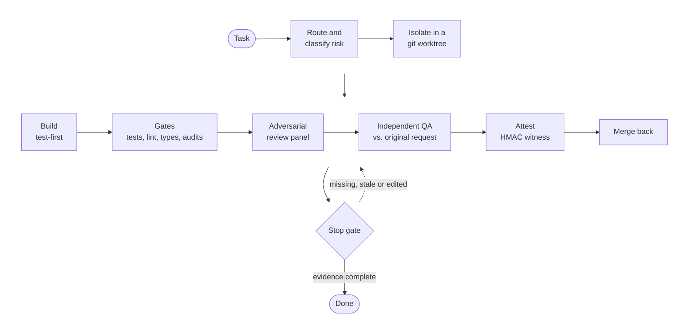

# Architecture

[README](README.md) · [AI security](docs/AI-SECURITY.md) · [Principles](docs/PRINCIPLES.md) · Jump to: [Plan to merge](#from-plan-to-merged-code) · [Lifecycle](#lifecycle-of-one-v-run) · [Mechanisms](#key-mechanisms) · [Agents](#agents) · [Stop-gate catalog](#stop-gate-catalog) · [Glossary](#glossary)

This document explains how the delivery pipeline, the orchestrator (`/v`) and its enforcement layer fit together, so you
can read the code without the context it was written in. For the motivation and results, start with the
[README](README.md); the security posture is in [`docs/AI-SECURITY.md`](docs/AI-SECURITY.md). The agents' standing instructions are in
[`docs/PRINCIPLES.md`](docs/PRINCIPLES.md).

## Two layers: a specification and an enforcement layer

| Layer | What it is | Where |
|---|---|---|
| **Specification** | A Claude Code *skill*: a long, structured prompt that tells the agent how to run a task end to end. It is executed by the model, so on its own it is only as reliable as the model's obedience. | [`skills/v/SKILL.md`](skills/v/SKILL.md) and the `.md` files in [`skills/v/references/`](skills/v/references/) |
| **Enforcement** | Shell hooks that Claude Code runs at fixed lifecycle events (before a tool call, after one, when the agent tries to stop), plus shared validators. They run outside the model's reasoning, so the agent can't simply talk its way past them. A few inputs still rest partly on the session's word; they are listed under [Known limits](docs/AI-SECURITY.md#known-limits). | [`hooks/`](hooks/), [`hooks/lib/`](hooks/lib/), and the scripts in [`skills/v/references/`](skills/v/references/) |

The design rule connecting them: **anything the specification says that has been violated in
practice gets moved into the enforcement layer.** The specification describes intent; the hooks
make the important parts non-negotiable.

## From plan to merged code

`/v` runs one task. Larger work arrives as a plan, and the build side turns that plan into many
`/v` sessions and lands their results in order.

| Stage | What happens | Where |
|---|---|---|
| **Plan** | A request becomes a plan with a per-task file breakdown. At standard or comprehensive depth, a plan with 4+ tasks also produces prompt packs, one per session, grouped so tasks that share a file land in the same session; a plan under about eight hours gets a checklist instead. | [`skills/v-plan/`](skills/v-plan/SKILL.md), [`skills/v-new-feature/`](skills/v-new-feature/SKILL.md) |
| **Ground** | `/v-prompt-pack-generate` checks each pack against the real code before writing it; packs the planner writes directly skip this check. It reads every file the pack modifies and re-checks the code locations the pack cites, confirms that files it creates don't exist yet, and checks any "already done by an earlier wave" claim against `main`, recording the commit. If a claim fails, generation either stops or marks the claim unverified and adds a check that halts the session if it proves false. | [`skills/v-prompt-pack-generate/`](skills/v-prompt-pack-generate/SKILL.md) |
| **Partition** | Packs share a wave only if their file sets are disjoint and neither depends on the other. Closing waves add a read-only verification pass and a final `99-*` verify pack. Security-bearing packs carry their own adversarial review. | [`v-runnable-pack-convention.md`](skills/references/v-runnable-pack-convention.md) |
| **Run** | Each pack is a headless `/v` session with a pinned session ID, up to five at once within a wave. The runner waits out rate limits, gives a session that hit its time limit while still making progress one more attempt (a stalled session gets none), and adopts sessions orphaned by a crashed earlier run. | [`bin/run-v-packs`](bin/run-v-packs), [`run-v-packs-lib/`](bin/run-v-packs-lib/) |
| **Build** | Inside a session, failing tests come first for backend logic (`/v-tdd`), then the implementation (`/v-build`). When `/v` invokes the builder, the builder stops after implementation; review, gates and merge belong to the orchestrator. | [`skills/v-tdd/`](skills/v-tdd/SKILL.md), [`skills/v-build/`](skills/v-build/SKILL.md) |
| **Land** | When a wave drains, its branches merge into `main` and a landing barrier checks that nothing is stranded or parked unverified. A wave that can't land stops the waves that depend on it. | [`60-wave.sh`](bin/run-v-packs-lib/60-wave.sh), [`v-drain-deferred-merges.sh`](skills/v/references/v-drain-deferred-merges.sh) |
| **Archive** | A pack moves to `.done/` when its session emitted the full gauntlet attestation and no gate verdict failed, when a read-only or no-op session passed its self-check, or when the session's own commits are already on `main`. A partial run, a rate limit or an error leaves the pack for the next pass. | [`30-verdict.sh`](bin/run-v-packs-lib/30-verdict.sh), [`40-archive-reconcile.sh`](bin/run-v-packs-lib/40-archive-reconcile.sh) |
| **Consolidate** | Leftover worktrees and branches from parallel work are merged back. Recently locked worktrees are skipped when the merge runs under the orchestrator; run directly, it asks before merging them. | [`skills/v-merge-all/`](skills/v-merge-all/SKILL.md) |

The runner is installed as `~/.local/bin/run-v-packs`; its 27 test files live in
[`scripts/`](scripts/) and run with the rest of the suite.

## Lifecycle of one `/v` run

Step numbers below match the headings in `SKILL.md`.

| Step | What happens | Mechanism |
|---|---|---|
| −3 | **Find the task.** Recover the user's request from capture channels scoped to the session ID first. The last-resort fallbacks aren't session-scoped: one takes the most recent `/v` request from the last 30 seconds, so two sessions started within the same half-minute could pick up each other's task. | [`v-resolve-task.sh`](skills/v/references/v-resolve-task.sh) |
| −2 / −1 / −0.5 | **Pre-checks.** Headless-mode detection, a hard branch gate (the main checkout must be on `main`), and a dirty-tree warning. | [`headless-detect.sh`](hooks/lib/headless-detect.sh) and the [`enforce-branch-gate.sh`](hooks/enforce-branch-gate.sh) `PreToolUse` hook; the warning is in the specification |
| 0 | **Bootstrap** in one call: session ID, project root, stack detection, and the **TRIVIAL** classifier. The **LIGHT** classifier runs immediately after. | [`v-bootstrap-wrapper.sh`](skills/v/references/v-bootstrap-wrapper.sh), [`v-bootstrap.sh`](skills/v/references/v-bootstrap.sh), [`v-classify-trivial.sh`](skills/v/references/v-classify-trivial.sh), [`v-classify-light-tier.sh`](skills/v/references/v-classify-light-tier.sh), [`resolve-sid.sh`](hooks/lib/resolve-sid.sh) |
| 1 | **Classify and route** (bug, feature, audit, refactor…). A "Final Guard" forces a route or at most one question. | [`v-classification-routing.md`](skills/v/references/v-classification-routing.md) |
| 1.5–1.8 | **Pre-implementation triage.** Async failure-mode expansion into failing tests, workflow blast radius, success criteria, and an **impact map** of consumers a diff-scoped reviewer can't see. | [`v-impact-analysis.md`](skills/v/references/v-impact-analysis.md) |
| 2–3 | **Isolate and build.** One git worktree per task, a per-session write ledger instead of `git status`, checkpoint commits, and test-first build. | [`session-writes.sh`](hooks/lib/session-writes.sh), [`v-active-siblings.sh`](skills/v/references/v-active-siblings.sh), [`v-winner-election.sh`](skills/v/references/v-winner-election.sh) |
| 3.4 | **Concurrent dispatch** (non-high-risk paths). The review panel and the gate runner run as sibling processes, and a review is promoted only if the gates pass. High-risk paths stay sequential. | [`v-supervise-children.sh`](skills/v/references/v-supervise-children.sh), [`v-dispatch-subagent.sh`](skills/v/references/v-dispatch-subagent.sh) |
| 4 | **Quality gates.** Tests, lint, type checks and dependency audits, run by a *mechanical* runner agent on the smallest tier (Haiku). Deterministic failures fail fast; only transient ones are retried. | [`agents/v-pre-flight-runner.md`](agents/v-pre-flight-runner.md), [`v-suite-lock.sh`](skills/v/references/v-suite-lock.sh) |
| 5 | **Adversarial review panel.** At least two reviewers on distinct lenses. The protocol is generate, then refute, keeping a finding on a majority "stands". The Stop gate verifies panel size, lens diversity, the finding arithmetic and provenance; it does not verify the refute step itself. | [`v-agent-review.md`](skills/v/references/v-agent-review.md), [`agents/adversarial-panel-reviewer.md`](agents/adversarial-panel-reviewer.md), [`v-emit-agent-review-skeleton.sh`](skills/v/references/v-emit-agent-review-skeleton.sh) |
| 6 | **Completion verification.** Convention checks, an independent QA loop against the *original* request (capped at 3 rounds), then **attestation**. | [`v-completion.md`](skills/v/references/v-completion.md), [`v-qa-acceptance.md`](skills/v/references/v-qa-acceptance.md), [`v-gauntlet-attest.sh`](skills/v/references/v-gauntlet-attest.sh), [`v-completion-selfcheck.sh`](skills/v/references/v-completion-selfcheck.sh) |
| 6.5 | **Merge back.** Lock and ownership checks, fast-forward or rebase, and **defer** (exit 3) rather than clobber a sibling's work in progress. | [`v-merge-back.sh`](skills/v/references/v-merge-back.sh) |
| 7 | **Stop.** The Stop gate re-validates the evidence before the session may end. | [`hooks/check-review-artifact.sh`](hooks/check-review-artifact.sh), [`stop-rearm.sh`](hooks/lib/stop-rearm.sh) |

## Key mechanisms

### 1. Risk tiers computed from the diff
A tiny change shouldn't pay for a full gauntlet, but an agent that's allowed to *claim* its change
is tiny will claim it. So classifiers compute the tier from the actual diff:
- **TRIVIAL:** at most 1 low-risk file and 3 changed lines (6 for prose or YAML). A stylesheet
  qualifies only through a separate cosmetic-UI route (up to 2 files). Classified at bootstrap;
  the Stop gate re-checks the marker and file count, but not the line or path rules.
- **LIGHT:** at most 4 non-test files and 30 changed lines of build/tooling configuration or non-UI configuration
  and support code (for example `config/`, `routes/`, `app/Support`, `app/Helpers`, JavaScript
  `lib`/`utils`). **Re-derived from the diff by the Stop gate.**
- **MEDIUM:** at most 10 non-test files and 400 changed lines, plus a test file with real changes. **Re-derived from
  the diff by the Stop gate.**

The LIGHT and MEDIUM classifiers exclude paths and diff content that look security-bearing
(authentication, payments, cryptography, webhooks, credentials), plus UI files and migrations.
They **fail closed**: if the security pattern library is missing, those tiers are unavailable.
The exclusion is a conservative pattern heuristic. Public API routes and authorization policies
are not excluded by path alone.
→ [`v-classify-trivial.sh`](skills/v/references/v-classify-trivial.sh), [`v-classify-light-tier.sh`](skills/v/references/v-classify-light-tier.sh), [`v-classify-medium-tier.sh`](skills/v/references/v-classify-medium-tier.sh), [`security-path-pattern.sh`](hooks/lib/security-path-pattern.sh), [`ui-path-pattern.sh`](hooks/lib/ui-path-pattern.sh), [`v-diff-scope.sh`](hooks/lib/v-diff-scope.sh)

### 2. Tamper-evident attestation
The failure it guards against: the agent skips the gauntlet and explains why it didn't need to,
while leftover reports from an earlier run satisfy the Stop gate. The attestation step checks that
the three gauntlet reports (gate report, review, convention check) are fresh for this run. It then
binds their SHA-256 hashes, and hashes of the source tree they graded, into an HMAC **witness**,
keyed by a per-install secret (file mode `0600`) plus the user ID. The key reaches the hash tool
through pipes, never on a command line where another local user could read it.

The Stop gate verifies it. A missing witness, a report edited after attestation, a corrupted HMAC,
or tree fields deleted, repointed or downgraded each blocks completion, and so does a change to the
session's code after attestation. The end-to-end test proves each case. What the witness proves is
that the reports weren't changed after attestation, not how they were produced. The header states
the honest limit: against a model running as the same OS user, this **raises the bar rather than
building a wall**.
→ [`v-gauntlet-attest.sh`](skills/v/references/v-gauntlet-attest.sh), [`gauntlet-witness.sh`](hooks/lib/gauntlet-witness.sh) (writer and verifier share one file so they can't drift)

### 3. A Stop gate with a termination guarantee
The Stop gate is the last word on whether a session may finish (catalog below). A gate that blocks
forever is its own failure mode, so a re-arm state machine **releases the session loudly** after 2
identical blocks or 4 blocks in one chain, and logs the escape. This trades strict blocking for
liveness. The limits are floored against being lowered, but can be raised.
→ [`check-review-artifact.sh`](hooks/check-review-artifact.sh), [`stop-rearm.sh`](hooks/lib/stop-rearm.sh), [`validation.sh`](hooks/lib/validation.sh) (the shared artifact validators)

### 4. Shared validators, run by both producer and gate
The orchestrator checks its own artifacts with the **same** structural validators the Stop gate
later runs, so they agree on what "valid" means, and a parity test pins that agreement.
Independent rejections are batched into one message rather than reported one per retry. The Stop
hook adds checks the producer deliberately doesn't run, such as the strict witness backstop.
→ [`v-completion-selfcheck.sh`](skills/v/references/v-completion-selfcheck.sh), [`validation.sh`](hooks/lib/validation.sh), [`validation-test.sh`](hooks/lib/validation-test.sh), [`v-contract-negative-test.sh`](skills/v/references/v-contract-negative-test.sh)

### 5. Review independence and provenance
The orchestrator runs as a forked-context skill, which cannot dispatch sub-agents. When dispatch was
unavailable, it silently fell back to reviewing its own work inline. So each panel reviewer now runs as a separate `claude -p --agent` process,
launched from a script. Capture-mode dispatch removes write tools from the reviewer's tool list.

Every dispatch is recorded in a provenance log: by the dispatcher script for subprocess
dispatches, and by a `PostToolUse` hook for in-process agent dispatches. The log is an audit
trail, not a signed proof. The gate counts distinct lens artifacts against it, so:
- **A declared inline fallback** is accepted with a warning, provided it shows evidence that the
  fallback chain was attempted.
- **An inline review on a high-risk change** is blocked, unless two hash-verified independent
  reviews ran. In that case completion proceeds and a review-debt marker queues a re-review.
→ [`v-dispatch-subagent.sh`](skills/v/references/v-dispatch-subagent.sh), [`record-agent-dispatch-provenance.sh`](hooks/record-agent-dispatch-provenance.sh), [`block-fork-agent-dispatch.sh`](hooks/block-fork-agent-dispatch.sh), [`protect-agent-review.sh`](hooks/protect-agent-review.sh), [`panel-review-validation-test.sh`](hooks/lib/panel-review-validation-test.sh)

### 6. Model tiering, enforced at dispatch
A three-layer `PreToolUse` hook:
1. It **denies** the inline route for the gate runners.
2. It **pins** gate-runner dispatches, identified by their prompt header, to the smallest tier (Haiku).
   An allow-listed override can raise the verify-done runner to the mid tier (Sonnet).
3. It **raises** 7 of the 8 review agents to the mid tier (Sonnet) when they are dispatched on Haiku.
   The eighth, `v-ux-critique-reviewer`, relies on its declared model.

It exists because the dispatch API's `model` parameter overrides an agent's declared model, so
reviewers had repeatedly been dispatched on the smallest tier while their definitions said
otherwise.
→ [`enforce-haiku-dispatch.sh`](hooks/enforce-haiku-dispatch.sh), [`enforce-haiku-dispatch-test.sh`](hooks/enforce-haiku-dispatch-test.sh), [`review-model-floor-test.sh`](hooks/review-model-floor-test.sh)

### 7. Parallel sessions without clobbering
Several sessions can run on one repository at once, and the system handles it:
- worktree per task;
- a per-session write ledger;
- sibling detection from lock files and transcript liveness;
- a cross-session test-suite mutex;
- when two sessions produce the same change, a script picks the copy that went furthest through the gauntlet;
- a merge-back that **defers** instead of overwriting.

→ [`v-merge-back.sh`](skills/v/references/v-merge-back.sh), [`session-lock-parse.sh`](hooks/lib/session-lock-parse.sh), [`session-liveness.sh`](hooks/lib/session-liveness.sh), [`git-main-root.sh`](hooks/lib/git-main-root.sh), [`v-suite-lock.sh`](skills/v/references/v-suite-lock.sh), [`v-winner-election.sh`](skills/v/references/v-winner-election.sh)

### 8. Cost measured from ground truth
Cost is tallied from the billed model on each transcript record, including sub-agent transcripts,
never from labels or intuition. Context size is likewise measured from transcript usage, against
fixed advisory thresholds.
→ [`cost-tally.py`](skills/v/references/cost-tally.py), [`cost-tally-test.sh`](skills/v/references/cost-tally-test.sh), [`v-context-guard.sh`](skills/v/references/v-context-guard.sh)

### 9. Verifying the verifier
A test that can't fail proves nothing, so several pieces check the checks:
- A **bite ledger** records each fix's test as RED against the pre-change code and GREEN after.
- A **mutation gate** injects a specific bug into guarded code and requires the harness to catch it.
- The **end-to-end test** drives the real merge-back, real Stop gate and real attestation through
  whole sessions.

→ [`v-bite-ledger.sh`](skills/v/references/v-bite-ledger.sh), [`mutation-gate.sh`](scripts/mutation-gate.sh), [`v-e2e-lifecycle-test.sh`](skills/v/references/v-e2e-lifecycle-test.sh)

### Cross-cutting rule: single-source predicates
Rules that several components need (what counts as a UI file, a code file, an artifact name, a
gate-bearing stack) live in one library that everything sources. As one header puts it: *every
copy rots independently and the stalest copy silently wins.* The exception is the security-path
list, which currently exists in three variants:
- the tier classifiers' pattern library;
- an inline pattern in the trivial classifier;
- the broader high-risk-review list in the validators.

→ [`hooks/lib/`](hooks/lib/), [`v-hostile-required.sh`](skills/v/references/v-hostile-required.sh), [`v-artifact-dir.sh`](skills/v/references/v-artifact-dir.sh)

## Agents

| Agent | Model | Write boundary | Role |
|---|---|---|---|
| [`adversarial-panel-reviewer`](agents/adversarial-panel-reviewer.md) | Sonnet | Advisory: instructed to write only its one artifact, but persistent agent memory re-grants write tools | One lens of the review panel: generate, then refute |
| [`security-reviewer`](agents/security-reviewer.md) · [`logic-reviewer`](agents/logic-reviewer.md) · [`codebase-fit-reviewer`](agents/codebase-fit-reviewer.md) | Sonnet | Advisory (same) | Specialist reviews by type of change |
| [`v-pre-flight-runner`](agents/v-pre-flight-runner.md) · [`v-verify-done-runner`](agents/v-verify-done-runner.md) | Haiku | `Write`, `Edit` and `NotebookEdit` denied; the shell remains | Mechanical gate execution and convention checks |
| [`v-qa-reviewer`](agents/v-qa-reviewer.md) · [`v-ux-critique-reviewer`](agents/v-ux-critique-reviewer.md) | Sonnet | Writes its report; [`readonly-edit-guard.sh`](hooks/readonly-edit-guard.sh) fences edits to source | Independent acceptance against the original request; UX heuristics |
| [`v-workflow-verifier`](agents/v-workflow-verifier.md) | Sonnet | Writes its report plus Playwright specs and config; fenced by the same hook | Browser-driven workflow verification |
| [`codex-adversarial-reviewer`](agents/codex-adversarial-reviewer.md) · [`framework-pitfall-reviewer`](agents/framework-pitfall-reviewer.md) | Sonnet | Read, search and shell tools, but advisory: persistent agent memory re-grants write tools | A second-opinion review through the Codex CLI, adjudicated against the code; and bug classes that survive normal review (framework overrides, environment half-guards, side effects before verification) |
| [`v-orchestrator-auditor`](agents/v-orchestrator-auditor.md) | Sonnet | `Write`, `Edit` and `NotebookEdit` denied | Read-only audits of the orchestrator itself, dispatched by `/v-self-audit` |

## Stop-gate catalog

The sections of [`hooks/check-review-artifact.sh`](hooks/check-review-artifact.sh), in file order.
Search the file for the token in backticks. Blocking gates are unmarked. *(warns)* and *(non-blocking)* mark
sections that only report. *(exit)* marks a sanctioned early exit. *(resolver)* marks setup that later gates rely on.

<b>Show all 21 catalog entries</b>

- **Bite-ledger reach** (`ECOSYSTEM REACH`): test-first evidence is required when the agent edits its own tooling.
- **Session-log integrity sweep** (`SESSION-LOG INTEGRITY SWEEP`) *(non-blocking)*
- **Worktree visibility** (`WORKTREE visibility`) *(resolver)*: finds session-owned worktrees even when the session ran on `main`.
- **`/v`-sessions-only policy** (`SESSIONS ONLY`) *(exit)*: sessions that never ran the orchestrator exit here, so the rest of the gate applies only to orchestrated sessions.
- **Abandonment detection** (`ABANDONMENT-DETECT`): a session that stops without its artifacts is
  blocked, and a handoff note can't be used to skip the gauntlet on code that already shipped.
- **Truth gate** (`W71 TRUTH GATE`) *(warns)*: flags narrow "nothing to do" claims in the final report that contradict the diff.
- **Survival gate** (`SURVIVAL GATE`): blocks when none of the source files the session wrote still
  carries a net change against the session baseline; partial loss only warns.
- **Exposed-inline-work gate** (`EXPOSED-INLINE-WORK GATE`): uncommitted source on shared `main` while
  sibling sessions are active.
- **Named-target gate** (`NAMED-TARGET GATE`) *(warns)*: did the diff touch the file the task named?
- **Boundary advisory** (`F2 BOUNDARY ADVISORY`) *(warns)*
- **Trivial-tier marker** (`TRIVIAL_PASS`) *(exit)*: accepted when structurally valid, fresh and
  within the file count.
- **Operational commit tags** (`W-LIGHT2-CHORE`) *(exit)*: sessions whose every commit carries a
  chore, CI-fix or merge tag.
- **Retry-cap handoff** (`CYCLE_CAP_HANDOFF`) *(exit)*: accepted as terminal when the retry cap was hit.
- **Light and medium tier verdicts** (`W-LIGHT2`, `W-MEDIUM`): recomputed here, never trusted from the session.
- **Core report gates** (`MISSING_PREFLIGHT`, `MISSING_REVIEW`, `MISSING_VERIFY`): the gate report, review and convention check must exist, pass structural validation, and not report a failing verdict.
- **Gate-independence provenance** (`GATE-INDEPENDENCE PROVENANCE`): artifacts must come from independent processes.
- **Worktree-orphan detection** (`worktree-orphan detection`): committed work that never reached `main`.
- **Gauntlet witness gate** (`gauntlet-attestation witness gate`): the attestation checks described above.
- **Stranded-merge** (`STRANDED WORKTREE-MERGE`) and **resolvable-deferral** (`resolvable-deferral`) gates
- **Artifact gates** (`IMPACT_MAP gate`, `QA_REPORT gate`, `UX_CRITIQUE gate`, `WORKFLOW_VERIFICATION gate`):
  each required only where it applies.
- **Bite-ledger gate** (`TDD bite evidence gate`), **wait-strand net** (`WAIT-STRAND`, warns by
  default), **hostile-dispatch gate** (`hostile-dispatch gate`) and **session-log telemetry gate**
  (`SESSION-LOG TELEMETRY`)

## Hook wiring

[`settings.json`](settings.json) wires **39 hook scripts across 8 lifecycle events**; it is the
live configuration with personal terminal integrations removed. [`settings.headless.json`](settings.headless.json)
is the smaller set (24 scripts across 4 events) used by headless runner sessions; two of them,
`parallel-test-throttle.sh` and `session-context-loader.sh`, are wired only there. The remaining six of
the 47 shipped hook scripts are wired in neither file: they are invoked by other scripts or kept for reference.

<b>Show the full wiring table</b>

| Event | Hooks |
|---|---|
| `PostToolUse` | [restore-hook-permissions](hooks/restore-hook-permissions.sh), [record-agent-dispatch-provenance](hooks/record-agent-dispatch-provenance.sh), [v-artifact-board](hooks/v-artifact-board.sh), [durable-artifact-copy](hooks/durable-artifact-copy.sh), [fork-payload-guard](hooks/fork-payload-guard.sh), [commit-witness-recorder](hooks/commit-witness-recorder.sh), [record-codex-dispatch-provenance](hooks/record-codex-dispatch-provenance.sh) |
| `PreCompact` | [pre-compact-worktree](hooks/pre-compact-worktree.sh) |
| `PreToolUse` | [capture-skill-args](hooks/capture-skill-args.sh), [enforce-haiku-dispatch](hooks/enforce-haiku-dispatch.sh), [block-fork-agent-dispatch](hooks/block-fork-agent-dispatch.sh), [refresh-session-id](hooks/refresh-session-id.sh), [worktree-safety](hooks/worktree-safety.sh), [database-destruction-guard](hooks/database-destruction-guard.sh), [protect-main-branch](hooks/protect-main-branch.sh), [enforce-pre-commit-gates](hooks/enforce-pre-commit-gates.sh), [block-pr-creation](hooks/block-pr-creation.sh), [dependency-install-guard](hooks/dependency-install-guard.sh), [block-vtmp-typo](hooks/block-vtmp-typo.sh), [block-v-polling](hooks/block-v-polling.sh), [track-session-writes](hooks/track-session-writes.sh), [block-cross-session-add](hooks/block-cross-session-add.sh), [enforce-branch-gate](hooks/enforce-branch-gate.sh), [worktree-write-boundary](hooks/worktree-write-boundary.sh), [readonly-edit-guard](hooks/readonly-edit-guard.sh), [artifact-location-check](hooks/artifact-location-check.sh), [protect-agent-review](hooks/protect-agent-review.sh) |
| `SessionStart` | [session-start-export-sid](hooks/session-start-export-sid.sh), [check-session-branch](hooks/check-session-branch.sh), [session-start-marker](hooks/session-start-marker.sh), [stop-drain-deferred-merges](hooks/stop-drain-deferred-merges.sh) |
| `Stop` | [abandonment-telemetry](hooks/abandonment-telemetry.sh), [check-review-artifact](hooks/check-review-artifact.sh), [uncommitted-changes-gate](hooks/uncommitted-changes-gate.sh), [stop-drain-deferred-merges](hooks/stop-drain-deferred-merges.sh) |
| `UserPromptSubmit` | [capture-user-prompt](hooks/capture-user-prompt.sh), [detect-readonly-intent](hooks/detect-readonly-intent.sh), [enforce-agent-review](hooks/enforce-agent-review.sh) |
| `WorktreeCreate` | [worktree-php-setup](hooks/worktree-php-setup.sh) |
| `WorktreeRemove` | [worktree-remove](hooks/worktree-remove.sh) |

## Glossary

Code comments carry historical work-item labels such as `W25-F10` or `H4-5`. They tie each guard to
the work that produced it. You can read the code without decoding them; the common patterns are
below, and the list is not exhaustive.

<b>Show the glossary</b>

| Code | Meaning |
|---|---|
| `W<n>`, `W<n>-F<m>` | **Wave** *n*, a numbered remediation batch; `F<m>` is finding *m* within it. |
| `W-LIGHT2`, `W-MEDIUM` | The light and medium risk-tier lanes. |
| `W-perf<n>` | Efficiency work items, e.g. committing before gates and a single artifact directory. |
| `W-REATTACH`, `W-DISPATCHLOCK` | A detached dispatch child that outlives the tool timeout; a per-dispatch lease. |
| `W-fork-fix` | Replacing in-process sub-agent dispatch with a `claude -p --agent` subprocess. |
| `W-<NAME>` | Other named work items; the name hints at the topic. |
| `W-NOGATE` | Exempts the pre-flight report from staleness re-runs when the tree has no gate-bearing stack, since a gate that executes nothing can't change its verdict. |
| `Bug 6` | The "gauntlet skipped" incident class that led to attestation. |
| `Lever A` / `Lever E` | Optimistic concurrent review; deterministic-failure fast-fail. |
| `H4-<n>` | Items from a hardening plan, e.g. H4-5 single-sourced the hostile-review predicate and H4-6 added semantic re-validation at merge-back. |
| `FND-<n>` | Numbered forensic findings, e.g. FND-3 is the merge-back "defer" (exit 3). |
| `SREV-<n>`, `CDX-<n>`, `CODEX-<n>`, `HIGH-<n>` | Finding IDs from adversarial reviews of a specific change. |
| `ORCHFIX-<x>`, `P<n>-…`, `HOOK-<n>`, `AVF-<n>`, `Item <n>` | Numbered items from audit and remediation plans. |
| `F<n>` | A finding number inside a dated batch. |
| `project-a` | A placeholder for a removed project name. |

## What this snapshot is and isn't

- **Scope:** the engineering lifecycle of a larger personal setup, as it runs locally: the
  orchestrator, 33 skills, 47 hook scripts and 28 hook libraries, 12 agents and 252 test files.
  [`settings.json`](settings.json) and [`settings.headless.json`](settings.headless.json) are the live
  hook wiring with personal terminal integrations removed. Written for this snapshot: the test runner,
  the portability lint, an HMAC test, the known-issues list, the gitleaks configuration, the CI
  workflow and this documentation.
- **Not included:** the marketing, content and growth skills, and the session-log subsystem (only its
  token extractor ships, because cost telemetry depends on it). A few shared references those skills
  also use do ship. `skills/v/SKILL.md` names 58 supporting files by path, and all of them ship; one
  hook it mentions by name, `dirty-tree-check.sh`, is not part of this snapshot. Some skills mention
  excluded skills by name.
- **Paths** assume Claude Code's standard `~/.claude` layout. The pack runner, installed as
  `~/.local/bin/run-v-packs` in the live setup, ships under `bin/`.
- **Tests:** run them with `bash scripts/run-tests.sh`, which copies the repository into a scratch
  `$HOME` first and clears the caller's Claude Code settings. It needs `bash`, `git`, `jq`, `python3`,
  `openssl`, `perl` and `shasum`. Two test files still have failing cases without a fix. In
  `v-dispatch-subagent-reattach-test.sh`, 14 checks fail every time under stock bash 3.2, and with GNU
  tools a few timing-sensitive ones fail under load. In `run-v-packs-watchdog-test.sh`, one case fails
  intermittently on the macOS CI runner. [`scripts/known-issues.txt`](scripts/known-issues.txt) records the most checks allowed to
  fail on each platform, and the runner reports the file as `KNOWN` only within that bound. A test file that skips entirely counts as a
  failure, since the runner supplies every file it needs; a skip because an optional tool such as PHP
  isn't installed is reported instead.
- **Changed for publication:**
  - Names of private projects and products, session identifiers, commit hashes, ticket numbers,
    real run times and dollar figures were removed or generalized in comments and messages. Test
    fixtures that reproduced private code were renamed to neutral identifiers, and each affected
    test was rerun.
  - The mutation gate's registry was trimmed to the 8 guards whose harnesses were verified for this
    snapshot (the live registry holds 52).
  - Assertions that need a pre-fix backup or machine-local state, which aren't shipped, print a
    visible skip. Five test files that could only run against the excluded session-log subsystem or
    such backups were left out.
  - A test runner was added.
