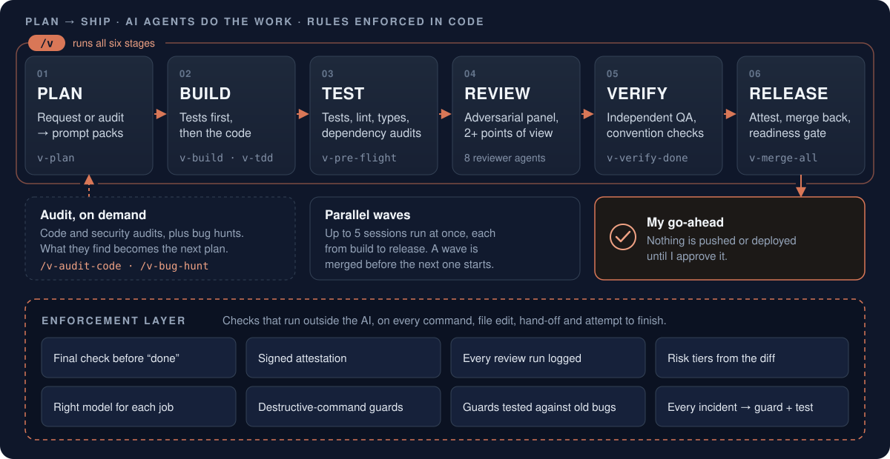
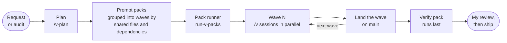
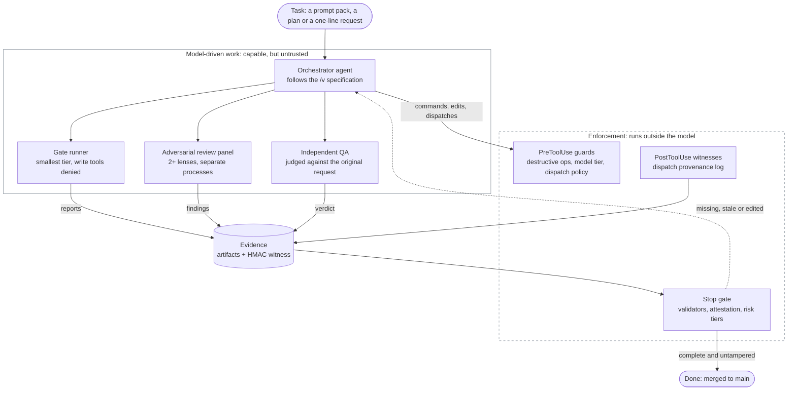
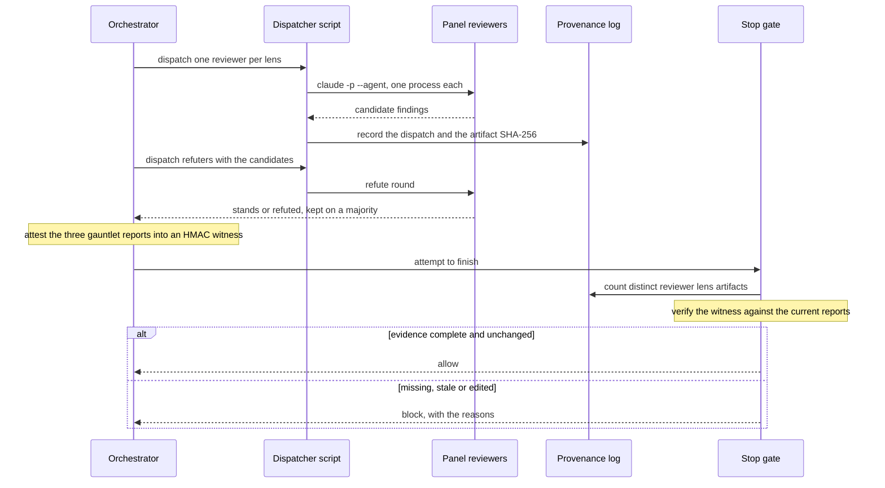
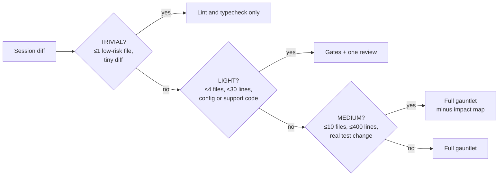

# AI Engineering Org

**What does good engineering management look like when part of the team is AI?** This is my working
answer: a delivery pipeline run by AI agents, where the rules that matter are enforced in code rather
than requested in prompts, "done" needs evidence, and the system itself is measured. Nothing ships
without my sign-off.

**Sudhir Prakash**, engineering leader · [sudhirprakash.com](https://sudhirprakash.com) · I use this to build my own products.

[](https://github.com/heat23/ai-engineering-org/actions/workflows/tests.yml)


<p align="center">
  
</p>

## In 30 seconds

- **What it is:** the delivery system I build my own products with. AI coding agents on
  [Claude Code](https://docs.claude.com/en/docs/claude-code/overview) take work from a plan to a
  release-ready merge, up to five sessions in parallel, directed by an orchestrator (`/v`) and 33
  workflow skills.
- **What it shows:** how I run engineering when part of the team is AI. The rules that matter are
  enforced in code, not requested in prompts. "Done" needs evidence. Review is independent and adversarial, including of
  my own work: when I ran my cost analysis through a review panel, it caught me double-counting spend.
  When the data disagreed with my design, I changed the design.
- **The evidence:** a measured record of 645 agent sessions, including where the controls fell short,
  and more than 3,200 automated checks in 252 test files, run in CI on macOS, Ubuntu and Debian. For 8
  guards, a mutation test injects the bug the guard exists for and confirms the tests catch it.
- **Check it yourself:** `bash scripts/run-tests.sh` runs everything in a scratch home directory in
  about ten minutes ([details](#run-it-about-ten-minutes)).

<table>
<tr>
<td align="center" width="25%"><h3>36%</h3>of 645 orchestrated sessions tried to finish before their checks were satisfied and were sent back at least once</td>
<td align="center" width="25%"><h3>75%</h3>of 363 review findings survived a challenge from the other reviewers; 21% were thrown out</td>
<td align="center" width="25%"><h3>91%</h3>of sub-agent cost was the orchestrator; review and gate runners were 1.2–2.4%. So I kept review and made the orchestrator opt-in</td>
<td align="center" width="25%"><h3>3,200+</h3>automated checks, including 8 mutation guards, run in CI on 3 platforms</td>
</tr>
</table>

> [!IMPORTANT]
> **Designed as if no human will review the code; operated with a person who does.** The agents are told
> the automated review layer is the only safety net, so every control has to stand on its own and
> its failures show up in the record. In practice, nothing ships without my review and action: I
> decide what gets pushed and deployed.

## How this maps to an engineering org

| Engineering-org function | Here |
|---|---|
| Planning and work breakdown | A planning agent turns a request into a plan, then into prompt packs grouped by shared files and dependencies |
| Plan validation before build | The pack generator checks each pack against the code before writing it, and checks any "already done" claim against `main` |
| Parallel teams and integration | A runner executes each wave of packs in parallel and lands it on `main` before the next wave starts |
| Peer code review | Adversarial review panel on distinct lenses |
| QA sign-off | An independent QA agent that judges the *original* request |
| Change risk classification | Risk tiers computed from the diff |
| Release gate | The Stop gate, plus a merge-back that defers rather than overwrites |
| Audit trail | A dispatch log (unsigned) and HMAC-signed attestation |
| Least-privilege access | Write tools denied to gate runners; runner exemptions bound to an HMAC token |
| FinOps | Model tiering at dispatch, plus billed-cost telemetry |
| Postmortems | Incident → guard → test; for 8 guards, a mutation test proves the test still catches the bug |

**What would change at team scale:**
- **Distribution:** policy distributed as versioned, signed configuration rather than per-machine
  files.
- **Trust root:** attestation keys held outside the agent's user account (in CI or a signing
  service), which closes the [same-user limit](docs/AI-SECURITY.md#known-limits).
- **Approval:** today that's me. At team scale, approval tiers by risk and code ownership, with
  this evidence attached to every change.
- **Ownership:** the enforcement layer grew one incident at a time, much of it in a single Stop-gate
  script. At team scale it would be split into smaller checks, each with a clear owner.

## Design principles

1. **Enforce, don't instruct.** A rule written in a prompt was violated by the same agent that acknowledged it, so what matters runs as a hook.
2. **Evidence over claims.** "Done" means the required artifacts exist, validate, are fresh and match their attested hashes.
3. **The builder doesn't grade its own work.** Reviewers run as separate processes, and a provenance log records every dispatch.
4. **Ceremony proportional to risk.** A config tweak shouldn't pay for the full gauntlet; a payments change must.
5. **Assume the agent will optimize for "done".** Design against proxy-satisfaction, and protect the guardrails themselves.
6. **Measure the system, not just the product.** When the data disagreed with my design, I changed the design.
7. **Every incident becomes a guard,** shipped with a test that proves it bites.

The rules the agents run under are in [`docs/PRINCIPLES.md`](docs/PRINCIPLES.md).

## Results

Each measure has its own window:
- **Cost:** the 402 Sonnet sessions before the orchestrator became opt-in.
- **Gate activity:** all 645 orchestrated Sonnet sessions.
- **Review yield:** the 77 panel reviews that passed validation.

### Cost: measured, then changed course

| Measure (Sonnet runs only) | Value |
|---|---|
| Orchestrator runs | 273, averaging 59 minutes each |
| Orchestrator share of sub-agent dispatch cost | 91% |
| Attributable reviewer and gate-runner dispatches, combined | 1.2% to 2.4%, depending on how mislabeled records are attributed. 183 unattributed dispatches (5.4%) are excluded. |

The review "ceremony" was cheap; the orchestrator was the cost. So I made the orchestrator opt-in:
it runs for high-risk or large changes and for prompt packs, and smaller ad hoc work runs direct with
proportional verification.

- **Outcome:** making the orchestrator opt-in did not lower spend. Weekly orchestrator spend on
  Sonnet stayed roughly flat afterwards (about 2% higher). What the data did settle: cutting review
  would have saved at most 2.4%, so review stayed on every code change.
- **A correction along the way:** my first analysis double-counted spend. A five-lens adversarial
  review panel caught it when I ran the analysis itself through one.

### Review yield

Across 77 validated panels:
- The panels raised **363** candidate findings.
- **271 were upheld (75%)** and **78 were refuted (21%)** by other panel members.
- **66 of the 77 reviews** upheld at least one finding.

### Gate activity

Stop hooks blocked **231 of 645** orchestrated sessions (36%) at least once before letting them
finish, with 545 blocks in total.

### A catch, and a miss

- **Caught:** the workflow-verification gate caught a UI race in which success and error
  notifications were silently dropped, and git history confirms the fix.
- **Missed:** two other defects passed the full gauntlet and surfaced later in a retrospective sweep.
  Passing the gates is evidence, not proof.

### What these numbers don't show

- **Causation:** why spend stayed flat after the orchestrator became opt-in.
- **Gate precision:** which of the 545 blocks were justified and which were friction.
- **Review ground truth:** "upheld" means a majority of the panel kept a finding: models judging
  models, not a human confirming a defect.
- **Generality:** every measurement comes from one operator's workload.

## Incidents that became guards

Every guard in this repository has an origin. A few of them:

| What happened (recorded in the code) | Guard | Test |
|---|---|---|
| In 3 of 5 sessions the model rationalized skipping the gauntlet. Leftover reports from an earlier run satisfied the Stop gate, and three sessions merged code into the local `main` branch without an automated review. | Freshness checks plus the HMAC witness | [`v-e2e-lifecycle-test.sh`](skills/v/references/v-e2e-lifecycle-test.sh) |
| Review prose claimed a cross-vendor review had run. Only 24 of 358 reviews actually evidenced one. | Lens artifacts counted against provenance | [`panel-review-validation-test.sh`](hooks/lib/panel-review-validation-test.sh) |
| Reviewers were dispatched on the smallest model, because the dispatch `model` parameter overrides an agent's declared model. | Review-model floor | [`review-model-floor-test.sh`](hooks/review-model-floor-test.sh) |
| A Stop-gate livelock: 39 blocks on one identical message over more than two hours. | Escape counter and livelock marker | [`stop-rearm-livelock-test.sh`](hooks/lib/stop-rearm-livelock-test.sh) |

## AI security

The model is treated as capable but fallible, and untrusted on completion claims: the controls that
matter run outside its reasoning, and evidence is verified rather than believed. Against the
[OWASP Top 10 for Agentic Applications (2026)](docs/AI-SECURITY.md#owasp-top-10-for-agentic-applications-2026),
my self-assessed coverage is **🟢 1 Strong · 🟡 7 Partial · 🔴 2 Gap**.

The limits that matter most:
- **Same-user threat model:** the agent runs as the same OS user as the hooks, so attestation raises
  the bar rather than building a wall.
- **Packs are trusted input:** the pack runner starts sessions with permission prompts bypassed, so
  whoever writes a pack can run commands as the agent.
- **Pattern-based guards:** the live guards catch accidents, not a determined or obfuscated attempt.
- **Not implemented:** network egress control, a dedicated secret scanner, sandboxing and a hard spend cap.

**[Read the full AI security write-up →](docs/AI-SECURITY.md)**

It covers the threat model, how the guardrails protect themselves, the OWASP mapping with its
Partial and Gap ratings, a NIST AI RMF crosswalk, and every known limit.

## How it works

<details>
<summary><b>Key terms</b></summary>

- **Orchestrator (`/v`):** a Claude Code *skill*, a long structured prompt that tells the agent how to run a task end to end.
- **Prompt pack:** one agent session's share of a plan, written as a self-contained prompt. Packs run in dependency waves.
- **Hook:** a script Claude Code runs at fixed points (before or after a tool call, and when the agent tries to stop), outside the model's reasoning.
- **Stop gate:** the `Stop` hook [`check-review-artifact.sh`](hooks/check-review-artifact.sh), which re-validates the evidence before a session may end.
- **Gauntlet:** the full verification sequence: impact map, quality gates, review panel, convention check, QA and attestation.
- **Witness:** an HMAC over the hashes of the three gauntlet reports and the source tree they graded. Editing a report, or the session's code, afterwards blocks completion.
- **Lens:** one reviewer's angle (scope, correctness, security, repro, fit or framework). A panel is two or more reviewers on distinct lenses.

</details>

Work moves through three levels: a plan becomes prompt packs, the packs run in waves, and each pack
is one `/v` session.

<details>
<summary><b>Diagram: from request to merge</b></summary>



</details>

### The lifecycle, skill by skill

| Stage | Skills | What they do |
|---|---|---|
| **Plan** | `/v-plan`, `/v-new-feature`, `/v-prompt-pack-generate`, `/v-discover-features` | Turn a request into a plan, a file-level breakdown and prompt packs; rank what to build next |
| **Build** | `/v-tdd`, `/v-build`, `/v-build-narrow`, `/v-scaffold`, `/v-polish` | Failing tests first, then the implementation; scaffolds that follow project conventions; UX hygiene on changed UI |
| **Test** | `/v-pre-flight`, `/v-verify-done`, `/v-ci-fix` | Quality gates (tests, lint, types, audits), convention checks, CI repair from the Actions logs |
| **Review** | 8 [reviewer agents](agents/), `/v-skill-reviewer`, `/v-anti-template-gauntlet` | Adversarial panels on distinct lenses, QA against the original request, UX critique, review of the skills themselves, conformance gates for user-visible output |
| **Audit** | `/v-check`, `/v-audit-code`, `/v-audit-admin`, `/v-bug-hunt`, `/v-audit-orchestrator`, `/v-audit-consolidate`, `/v-prod-triage` | Multi-dimension code audits, adversarial bug hunts, consolidated findings, production health triage |
| **Release** | `/v-prelaunch-readiness`, `/v-launch`, `/v-merge-all` | Readiness for strangers, launch gating, merging parallel work back safely |
| **Operate** | `/v-self-audit`, `/v-forensics`, `/v-forensics-pack-runner`, `/v-handoff`, `/v-next`, `/v-help`, `/v-maintenance`, `/v-setup-project`, `/v-docs` | Audits and post-mortems of the orchestrator itself, session handoff, what to work on next, config upkeep, project bootstrap, documentation |

Each skill lives in [`skills/`](skills/) as a `SKILL.md` with its references. Marketing, content and
growth skills from the same setup are not part of this repository.

### Inside one session

Inside each session, the model plans and does the work. What decides whether the work is
*acceptable* runs outside the model's reasoning.



<details>
<summary><b>Sequence view: how review and attestation fit together</b></summary>



The Stop gate verifies:
- **Panel structure:** size, lens diversity and the finding arithmetic.
- **Provenance:** the reviewer artifacts against the dispatch log.
- **Integrity:** the witness against the current reports.

The refute-and-majority step itself is orchestrator protocol; no hook checks it.

</details>

### Risk-proportional verification

Proportionality works in two layers. Direct work is the default; the orchestrator runs for high-risk
or large changes, for every prompt pack, and when I ask for it. Inside it, classifiers compute a tier from the actual diff:
- **LIGHT and MEDIUM** are re-derived by the Stop gate at the end of the session.
- **TRIVIAL** is classified at bootstrap.

LIGHT and MEDIUM exclude paths and diff content that look security-bearing, plus UI files and
migrations. This is a conservative pattern heuristic, not a proof
([details](ARCHITECTURE.md#1-risk-tiers-computed-from-the-diff)).



## Guardrails

### Shipped in this repository

| Guardrail | What it prevents | How it's enforced |
|---|---|---|
| **Stop gate** | Declaring "done" without proof | Re-validates the gate report, review and convention check, plus QA, impact-map, UX and workflow verdicts where they apply. |
| **Tamper-evident attestation** | Skipping the gauntlet, or changing a report or the code after grading | An HMAC witness over the three reports' SHA-256 hashes and the graded source tree, keyed by a per-install `0600` secret plus the user ID. The key never appears on a command line. |
| **Adversarial review panel** | Rubber-stamp review | 2+ reviewers on distinct lenses, checked against the provenance log. An approval that leaves critical or high findings unresolved is rejected. |
| **Out-of-process review** | Silent self-review | Reviewers run as separate `claude -p --agent` processes. An inline fallback is accepted only with a warning, and is blocked on high-risk reviews unless two independent reviews ran. |
| **Model tiering** | Cheap models judging code, expensive ones on mechanical work | A `PreToolUse` hook pins gate runners to the smallest tier (Haiku) and raises 7 named review agents to the mid tier (Sonnet). |
| **Termination guarantee** | A gate that blocks forever | After 2 identical blocks (or 4 in a chain) the Stop gate releases the session, loudly and with a logged escape. |

<details>
<summary><b>7 more shipped guardrails</b></summary>

| Guardrail | What it prevents | How it's enforced |
|---|---|---|
| **Independent QA** | Grading the work against the implementer's own summary | A QA agent judges the *original* request, with at most 3 remediation rounds (orchestrator protocol). |
| **Survival and truth checks** | Claiming work that isn't there | Blocks if none of the session's source writes still carries a net change against its baseline. A truth gate warns on narrow "nothing to do" claims that contradict the diff. |
| **Producer/gate parity** | The orchestrator and the gate disagreeing on "valid" | The orchestrator self-checks with the same structural validators the Stop gate runs, and a parity test pins it. |
| **Least privilege (partial)** | Agents "fixing" what they should only report | Gate runners have `Write`, `Edit` and `NotebookEdit` denied. For in-process dispatch, reviewer write scope is advisory, because persistent agent memory re-grants write tools. Subprocess capture mode removes write tools. |
| **Bounded retries** | Burning money on deterministic failures | Retries only on a timeout or a classified temporary failure, never on a real gate failure. |
| **Parallel-session isolation** | Sessions trampling each other | Worktree per task, a per-session write ledger, a cross-session suite lock, and a merge-back that defers (exit 3) instead of overwriting. |
| **Cost telemetry** | Optimizing on guesses | Cost is tallied from the billed model on every transcript record, sub-agents included. Context size is checked against fixed advisory thresholds. |

</details>

### Workflow guards

<details>
<summary><b>10 more guards that run before and after the agent's tool calls</b></summary>

| Guardrail | Scope | Hook |
|---|---|---|
| **Destructive-database tripwire** | Denies `migrate:fresh`, `migrate:reset` and `db:wipe`; `eloquent:prune` outside local and testing environments; and SQL `TRUNCATE TABLE`, `DROP TABLE`, `DROP DATABASE`, `DROP SCHEMA` and `DELETE` without `WHERE` in shell commands. It matches command text, so it catches accidents, not obfuscation. | [`database-destruction-guard`](hooks/database-destruction-guard.sh) |
| **Git safety** | Denies force pushes and non-sanctioned pushes to `main`, `reset --hard`, `clean -f`, `checkout -- .`, branch switching on the main checkout, and `stash` while worktrees are active. | [`protect-main-branch`](hooks/protect-main-branch.sh), [`worktree-safety`](hooks/worktree-safety.sh) |
| **Pre-commit gate** | Denies `git commit` when the required gate report and review are missing or invalid. | [`enforce-pre-commit-gates`](hooks/enforce-pre-commit-gates.sh) |
| **Worktree write boundary** | Denies Edit/Write of source files into the shared main checkout while the session owns a worktree. | [`worktree-write-boundary`](hooks/worktree-write-boundary.sh) |
| **Cross-session commit guard** | Denies a sweeping `git add -A` or `commit -a` that would stage files another live session wrote and hasn't committed. | [`block-cross-session-add`](hooks/block-cross-session-add.sh) |
| **Read-only intent** | When a request explicitly asks for read-only work, Edit/Write to tracked source files is denied; reports can still be written. | [`detect-readonly-intent`](hooks/detect-readonly-intent.sh), [`readonly-edit-guard`](hooks/readonly-edit-guard.sh) |
| **No autonomous PRs** | Denies `gh pr create` and pull-request-creation MCP tools. Only a runner-launched task pack that declares PR mode can opt in. | [`block-pr-creation`](hooks/block-pr-creation.sh) |
| **Dependency guard** | Denies `npm`/`pnpm`/`yarn` installs of a named package and `composer require` until the human confirms. Other package managers, and manifest edits followed by a bare install, are not covered. | [`dependency-install-guard`](hooks/dependency-install-guard.sh) |
| **Uncommitted-changes gate** | Blocks completion while tracked files this session modified have unstaged changes. | [`uncommitted-changes-gate`](hooks/uncommitted-changes-gate.sh) |
| **Hook-permission restorer** | Restores the executable bit on hook scripts after edits. | [`restore-hook-permissions`](hooks/restore-hook-permissions.sh) |

[`settings.json`](settings.json), the sanitized copy of the live configuration, wires 39 of the 47 hook
scripts; [`settings.headless.json`](settings.headless.json) covers headless runner sessions.

</details>

## Try it

### Read it

**Evaluating how I lead (about five minutes):** [Results](#results),
[Incidents that became guards](#incidents-that-became-guards), [`docs/PRINCIPLES.md`](docs/PRINCIPLES.md)
and the [known limits](docs/AI-SECURITY.md#known-limits).

**Evaluating the engineering (about fifteen minutes):**

1. **[`ARCHITECTURE.md`](ARCHITECTURE.md), down to mechanism 3:** the plan-to-merge pipeline, the
   lifecycle of one session, risk tiers, attestation and the Stop gate.
2. **[`skills/v-prompt-pack-generate/SKILL.md`](skills/v-prompt-pack-generate/SKILL.md), Step 1:**
   how a plan is checked against the real code before any prompt pack is written, and why an
   "already done" claim has to be proven on `main`.
3. **[`hooks/enforce-haiku-dispatch.sh`](hooks/enforce-haiku-dispatch.sh), all 168 lines:** the one
   hook short enough to read whole. It shows the hook protocol (JSON on stdin, an `updatedInput`
   rewrite, exit 2 to block) before you meet the Stop gate.
4. **The Stop gate's witness section:** [`check-review-artifact.sh` lines 2875–3196](hooks/check-review-artifact.sh#L2875-L3196).
   For a map of the whole file, list its 62 section headers with
   `grep -nE '^# (=== |── )' hooks/check-review-artifact.sh`.
5. **Scenario E of [`v-e2e-lifecycle-test.sh`](skills/v/references/v-e2e-lifecycle-test.sh):** the
   missing-witness, tampered-report, corrupted-HMAC and tampered-tree cases (E2 to E8).

With more time:

| To see… | Open |
|---|---|
| The orchestrator's specification, written as a prompt for the agent (start at "ABSOLUTE COMPLETION GATE"; its frontmatter attaches the Stop gate) | [`skills/v/SKILL.md`](skills/v/SKILL.md) |
| Writing the code: failing tests, then the implementation | [`skills/v-tdd/SKILL.md`](skills/v-tdd/SKILL.md), [`skills/v-build/SKILL.md`](skills/v-build/SKILL.md) |
| Running packs in waves and landing each wave on `main` (the header lists everything it does) | [`bin/run-v-packs`](bin/run-v-packs), [`bin/run-v-packs-lib/`](bin/run-v-packs-lib/) |
| Pack conventions: waves, closing verification, security-bearing packs | [`v-runnable-pack-convention.md`](skills/references/v-runnable-pack-convention.md) |
| Merging parallel work without overwriting a live session | [`skills/v-merge-all/SKILL.md`](skills/v-merge-all/SKILL.md) |
| Tamper-evident attestation | [`v-gauntlet-attest.sh`](skills/v/references/v-gauntlet-attest.sh), [`gauntlet-witness.sh`](hooks/lib/gauntlet-witness.sh) |
| Diff-derived risk tiers | [`v-classify-light-tier.sh`](skills/v/references/v-classify-light-tier.sh), [`v-classify-medium-tier.sh`](skills/v/references/v-classify-medium-tier.sh) |
| Out-of-process sub-agents | [`v-dispatch-subagent.sh`](skills/v/references/v-dispatch-subagent.sh) |
| Threat model, OWASP mapping and known limits | [`docs/AI-SECURITY.md`](docs/AI-SECURITY.md) |
| The rules the agents run under | [`docs/PRINCIPLES.md`](docs/PRINCIPLES.md) |

### Run it (about ten minutes)

```bash
git clone https://github.com/heat23/ai-engineering-org.git
cd ai-engineering-org
bash scripts/run-tests.sh
```

Expected final line on stock macOS:

```text
checks passed: 3236   skipped: 3   failing files: 0   known issues: 1
```

- **checks passed** counts the test assertions plus the 8 mutation guards. The total differs slightly
  by platform, because the one known-issue file passes a different number of checks on each.
- **skipped** assertions need inputs that aren't in this snapshot, such as a pre-fix backup.
- **known issues: 1** is a test with failing cases that isn't fixed yet: re-attaching to a detached
  dispatch after its helper is killed. It's listed in [`known-issues.txt`](scripts/known-issues.txt)
  with the most checks allowed to fail on each platform; one more counts as a real failure.

The runner copies the repository into a scratch `$HOME` and clears your Claude Code settings from the
environment, so nothing on your machine is touched. Use it rather than running a test file directly:
each test expects to find the snapshot under `~/.claude`. If a file fails, the runner shows the end
of its output; a file that skips entirely also counts as a failure. Pass part of a path to run a
subset, for example `bash scripts/run-tests.sh hooks/`. It requires `bash`, `git`, `jq`, `python3`,
`openssl`, `perl` and `shasum`. [`tests.yml`](.github/workflows/tests.yml) runs the suite on every
push on macOS with the stock bash 3.2, on Ubuntu with GNU tools, and on Debian 12, whose older mawk is
the strictest `awk` these scripts are likely to meet. A [portability lint](scripts/portability-test.sh)
catches the bug classes that pass on one of those platforms and fail on another.

What the tests prove:
- **The end-to-end test drives the real thing:** the real merge-back, Stop gate and attestation,
  through whole sessions. It shows that a missing witness, an edited report, a corrupted HMAC, edited
  source-tree fields and a post-attestation code change are each **blocked**.
- **The mutation gate verifies the verifier.** It injects a specific bug into guarded code and
  requires the harness to catch it.

### Reuse one piece

<details>
<summary><b>Example: enforce model tiering in your own Claude Code setup</b></summary>

The full orchestrator isn't a drop-in install, because it references files that aren't included.
Some parts stand alone. To enforce model tiering on your own dispatches:

```bash
mkdir -p ~/.claude/hooks/lib        # back up any existing files with the same names first
cp hooks/enforce-haiku-dispatch.sh ~/.claude/hooks/
cp hooks/lib/require-jq.sh ~/.claude/hooks/lib/
```

Then add this entry to the `hooks.PreToolUse` array in `~/.claude/settings.json`, keeping any
existing entries:

```json
{
  "hooks": {
    "PreToolUse": [
      {
        "matcher": "Skill|Agent",
        "hooks": [{ "type": "command", "command": "~/.claude/hooks/enforce-haiku-dispatch.sh" }]
      }
    ]
  }
}
```

From then on, a dispatch with `model: "haiku"` to any of 7 named review agents (the `case` list near
the end of the hook; add your own) is raised to Sonnet. A dispatch with no explicit model is left
alone. Check it:

```bash
echo '{"tool_name":"Agent","tool_input":{"subagent_type":"security-reviewer","model":"haiku","prompt":"x"}}' \
  | ~/.claude/hooks/enforce-haiku-dispatch.sh      # prints "model": "sonnet"
```

> [!WARNING]
> The hook fails closed: without `jq` installed it blocks every Skill and Agent call.

`security-reviewer`, `logic-reviewer` and `codebase-fit-reviewer` are self-contained and can be
copied into `~/.claude/agents/` the same way. The other agents expect the orchestrator's prompts and
artifacts.

</details>

## About this snapshot

- **The engineering side of a larger personal setup, not an installable package.** It ships the
  orchestrator, the planning, build, review, test, audit and release skills, every hook wired in
  [`settings.json`](settings.json), and the reviewer agents. Marketing, content and growth skills
  are left out. Paths assume Claude Code's `~/.claude` layout;
  [`ARCHITECTURE.md`](ARCHITECTURE.md#what-this-snapshot-is-and-isnt) has the details.
- **Sanitized for publication.** Names of private projects and products, session identifiers,
  commit hashes, ticket numbers, real run times and dollar figures were removed or generalized. Internal tracking codes (e.g. `W25-F10`)
  remain, and the [glossary](ARCHITECTURE.md#glossary) explains the common patterns.
- **Layout:**
  - `skills/v/`: the orchestrator's specification and its scripts.
  - `skills/v-*/`: the 33 lifecycle skills listed in [the lifecycle table](#the-lifecycle-skill-by-skill),
    with shared conventions in `skills/_v-*.md` and shared references in `skills/references/`.
  - `bin/`: the pack runner (`run-v-packs`, installed as `~/.local/bin/run-v-packs`) and its library.
  - `hooks/` and `hooks/lib/`: enforcement and shared validators, wired by [`settings.json`](settings.json).
  - `agents/`: the 12 agent definitions: 8 reviewers, 2 gate runners, an auditor and a workflow verifier.
  - `scripts/`: the test runner, the mutation gate, and the pack runner's tests and helpers.
  - `docs/`: the agents' operating principles, the AI security write-up and the diagram above.

## License

[MIT](LICENSE)
